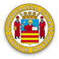
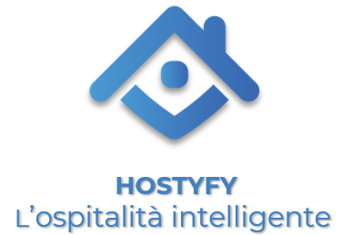
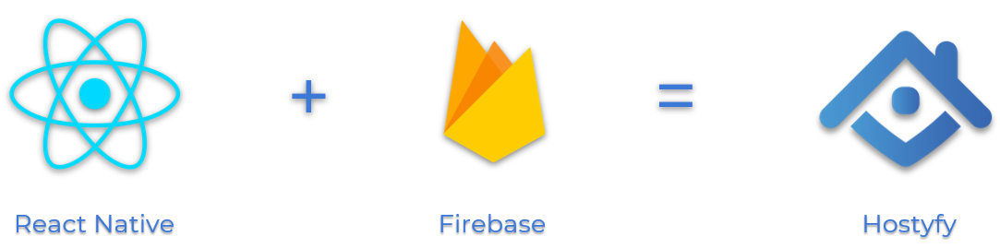

# Hostyfy - L'ospitalità intelligente made in Italy

  
  
  
  

  

Progetto universitario per il corso "Enterprise Mobile Application Development" tenuto presso il Dipartimento di Informatica dell'Università degli Studi di Salerno.

## Scopo del progetto
Lo scopo del progetto è quello di realizzare un software gestionale 4.0 che permette la gestione di strutture ricettive alberghiere ed extra alberghiere quali hotel, B&B, casa vacanze, etc. Il suo obiettivo è quello di facilitare la collaborazione tra host e guest, ovvero gli utenti a cui sarà destinato questo strumento. 

## Features
  - Booking Engine (prenotazione diretta tradizionale)
  - Guest and Host Portal
  - Gestione di una struttura e relativi alloggi
  - Check-in e Check-out automatizzato 
  - Welcome Video
  - Upgrade and Downgrade Host
  - Clean Service
  - Reviews 

## Sviluppi futuri
 - Shop Online
 - Camere Smart
 - Analytics
 - Community
 - Vertical Booking
 - Channel Manager
 - Premium services for Host

## Tecnologie utilizzate

  

## Documentazione associata
 - Requirement Analysis Document (RAD) 
 - Presentazione PowerPoint Startup
 - Brochure Hostyfy for App Challenge

## Team
  Sviluppatori
  - Raimondo Ranaldo
  - Gerardo Michele Laucella
  - Gennaro Teodoro

  Economia e management (DISA-MIS)
  - Nunzio Annunziata
  - Giovanni Baldi
  - Francesco Fontana
  - Alfonso Senatore,
  - Vincenzo Verde
